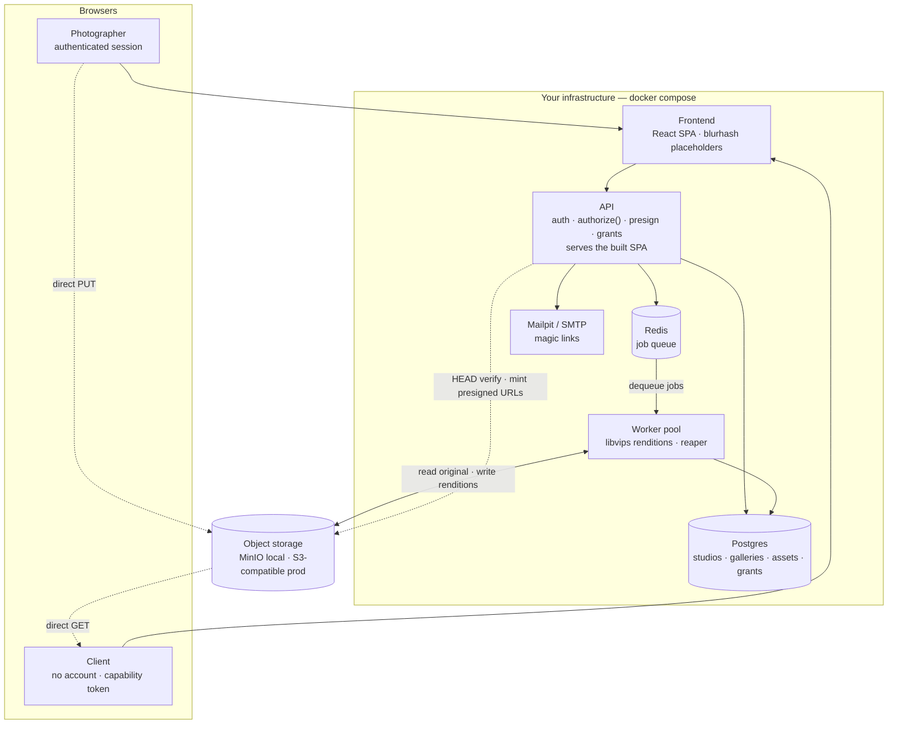

<div align="center">

# Pixhaus

**Self-hostable client galleries for photographers.**
Upload photos, send a link, done — your clients never make an account.

[](https://github.com/RaresPetrisor22/pixhaus/actions/workflows/ci.yml)


</div>

> **Status: early development.** Not yet ready for production use. See the [roadmap](#roadmap).

<!-- Add a screenshot here as soon as you have one. It's the single highest-impact thing in this file. -->

## Contents

- [Why](#why)
- [Features](#features)
- [Tech stack](#tech-stack)
- [How it works](#how-it-works)
- [Quick start](#quick-start)
- [The API](#the-api)
- [Working on the code](#working-on-the-code)
- [How auth works](#how-auth-works)
- [Configuration](#configuration)
- [Roadmap](#roadmap)
- [Documentation](#documentation)
- [License](#license)

## Why

Every client gallery product is a subscription. Pixieset's free tier is 3 GB — about half a wedding.

Pixhaus is the same core workflow without the meter: run your own instance, or register for an invite to
the managed one. Roughly $0.15/month per 10 GB instead of $10.

## Features

- Upload full-resolution photos straight from the browser to S3-compatible storage
- Automatic thumbnails and web previews (ICC-correct, EXIF stripped)
- Share links with expiry, per-link permissions, and instant revocation
- **Clients need no account** — just a link
- Download single photos, direct from storage

Mentioned so the scope is clear; not built yet:

- Download the whole gallery as a zip (M4)
- Proofing mode: clients heart favorites and submit a selection (M5)

## Tech stack

| Layer   | Stack                                                                                                                                                                                                                                                                          | Notes                                                                            |
| ------- | ------------------------------------------------------------------------------------------------------------------------------------------------------------------------------------------------------------------------------------------------------------------------------ | -------------------------------------------------------------------------------- |
| API     |             | Every boundary — env, body, query — parsed by a schema                           |
| Data    |                                                                                                                                                                                | All persistent state, with row-level security per tenant                         |
| Jobs    |                                                                                                                                         | Rendition queue and the reaper's 15-minute sweep                                 |
| Images  |                                                                                                                                                                      | Not ImageMagick — the memory profile matters on 40 MB files                      |
| Web     |                | Served by the API from the same origin: no CORS, one cookie                      |
| Storage |                                                                                             | Behind a thin interface — any S3-compatible provider is config, not code         |
| Runtime |                  | One `docker compose up`; Caddy terminates TLS in production                      |
| Tooling |    | Workspace monorepo; CI runs format, lint, typecheck, build, tests and migrations |

## How it works



**Dashed edges are image bytes moving without touching the API.** That is the property that makes the
whole thing cheap to run: every client view and every download goes storage → browser directly, so
your servers see the bytes exactly once, during rendition generation.

A few decisions worth knowing before you read the code:

- **One gallery model, not two.** A gallery is a set of photos plus a grant of rights to an audience for
  a window. Delivery is `{view, download}`; proofing is `{view, favorite}`. Same table, different rights.
- **Clients have no accounts.** Access is a capability grant — a database row that _is_ the permission,
  presented via a signed magic link. Expiring, revocable, no password.
- **Photo bytes never touch the API.** Uploads go browser → bucket via presigned URL; downloads go
  bucket → browser. The API mints URLs and verifies objects server-side after upload.

More diagrams, all in [`docs/architecture.md`](docs/architecture.md):

| Diagram                                                                  | What it shows                                                                    |
| ------------------------------------------------------------------------ | -------------------------------------------------------------------------------- |
| [Data model](docs/architecture.md#2-data-model)                          | Eight tables, and why `studio_id` is denormalized onto every tenant-owned one    |
| [Upload pipeline](docs/architecture.md#3-upload-pipeline)                | Presign → direct PUT → server-side finalize → worker renditions                  |
| [Client access](docs/architecture.md#4-client-access--capability-grants) | Magic link → short-lived signed token → presigned URLs, and how revocation bites |
| [Asset lifecycle](docs/architecture.md#5-asset-lifecycle)                | `pending → uploaded → processing → ready`, plus `orphaned` and the reaper        |
| [Threat model](docs/architecture.md#threat-model)                        | Each threat against the thing that actually stops it                             |

## Quick start

```bash
git clone https://github.com/RaresPetrisor22/pixhaus
cd pixhaus
cp .env.example .env
docker compose up -d --wait
```

That is the whole thing — no Node install required. Compose starts Postgres, Redis, MinIO (local S3)
and Mailpit (catches outgoing email at http://localhost:8025), applies the database migrations, and
serves the API and the web app on http://localhost:3000. No external accounts needed to try it.

`--wait` blocks until every service passes its health check, so when the command returns the stack is
genuinely ready rather than merely started.

| Endpoint   | Answers                                                                                                  |
| ---------- | -------------------------------------------------------------------------------------------------------- |
| `/healthz` | Is the process alive? Checks nothing else, so a database blip cannot cause a restart loop.               |
| `/readyz`  | Should this instance receive traffic? Checks Postgres, Redis and object storage; `503` when any is down. |

Register from the web app at http://localhost:3000, or straight from the shell:

```bash
curl -X POST localhost:3000/api/auth/register -H 'content-type: application/json' \
  -d '{"studioName":"Your Studio","email":"you@example.com","password":"a long passphrase"}'
```

Outgoing mail lands in Mailpit at http://localhost:8025; in development the verification link is also
written to the API log.

## The API

Every route, with its exact semantics and error codes, is in [`docs/api.md`](docs/api.md).

Photographer accounts work as of M1:

| Method   | Route                           | Auth    |
| -------- | ------------------------------- | ------- |
| `POST`   | `/api/auth/register`            | public  |
| `POST`   | `/api/auth/verify-email`        | public  |
| `POST`   | `/api/auth/resend-verification` | public  |
| `POST`   | `/api/auth/login`               | public  |
| `POST`   | `/api/auth/logout`              | session |
| `DELETE` | `/api/auth/sessions`            | session |
| `GET`    | `/api/auth/me`                  | session |

Galleries, uploads and renditions work as of M2:

| Method   | Route                                   | Auth    |
| -------- | --------------------------------------- | ------- |
| `POST`   | `/api/galleries`                        | session |
| `GET`    | `/api/galleries`                        | session |
| `GET`    | `/api/galleries/:galleryId`             | session |
| `PATCH`  | `/api/galleries/:galleryId`             | session |
| `DELETE` | `/api/galleries/:galleryId`             | session |
| `POST`   | `/api/galleries/:galleryId/uploads`     | session |
| `POST`   | `/api/uploads/:assetId/finalize`        | session |
| `GET`    | `/api/galleries/:galleryId/assets`      | session |
| `DELETE` | `/api/assets/:assetId`                  | session |
| `GET`    | `/api/assets/:assetId/renditions/:kind` | session |

Upload is three calls: mint a presigned PUT, PUT the bytes straight to the bucket, then finalize —
which is where the server goes and looks at what actually landed. A background worker then writes
`thumb`, `grid` and `preview` renditions plus a blurhash placeholder.

Share links and the client gallery work as of M3:

| Method   | Route                                          | Auth             |
| -------- | ---------------------------------------------- | ---------------- |
| `POST`   | `/api/galleries/:galleryId/grants`             | session          |
| `GET`    | `/api/galleries/:galleryId/grants`             | session          |
| `DELETE` | `/api/grants/:grantId`                         | session          |
| `POST`   | `/api/grants/:grantId/resend`                  | session          |
| `GET`    | `/g/:token`                                    | public           |
| `POST`   | `/api/client/token`                            | grant            |
| `GET`    | `/api/client/gallery`                          | `grant:view`     |
| `GET`    | `/api/client/assets/:assetId/renditions/:kind` | `grant:view`     |
| `POST`   | `/api/client/assets/:assetId/download`         | `grant:download` |

Creating the first share link on a gallery flips it from `draft` to `active` — sharing is what
publishes it. The raw link token is in the create response and in the email, and nowhere else: the
database stores only its SHA-256.

## Working on the code

Compose runs the API from a built image, so it will not pick up source edits. The same is true of
`worker` and `migrate` — `migrate` copies `packages/db/migrations/` in at build time, so a new
migration is invisible to it until the image is rebuilt. Either rebuild:

```bash
docker compose up -d --build            # or: --build api worker migrate
```

or run the API on the host against the compose services, which is faster to iterate on:

```bash
pnpm install
pnpm db:migrate          # migrations from your shell, as the owner role
pnpm build && pnpm api   # http://localhost:3000
```

Stop the containerised API first (`docker compose stop api`) or the two will fight over port 3000.

**Three compose files, selected by `COMPOSE_FILE` in `.env`.** The base `docker-compose.yml` is
production-shaped — Postgres, Redis, the migration runner, the API and the worker, with nothing
standing in for anything. `docker-compose.dev.yml` adds MinIO and Mailpit and points the API at them;
`docker-compose.prod.yml` adds Caddy. `.env.example` selects the dev overlay, so `docker compose up`
still needs no flags.

`pnpm test` runs the unit suites across the API, the worker and the packages. The row-level-security
suite in `packages/db` is the one part that needs a database: it runs against `TEST_DATABASE_URL` or
`DATABASE_URL` when one is reachable, and skips with a message when neither is.

> **Editing `docker/postgres/init/`?** It runs once, on an empty data volume. Re-run it with
> `docker compose down -v && docker compose up -d --wait`.

> **Never edit an applied migration**, comments included: the runner records a checksum and refuses
> to continue when the file no longer matches. Write the next numbered file instead.

### The worker

Its own compose service, consuming the rendition queue and scheduling the reaper:

```bash
docker compose logs -f worker
```

Run it on the host instead with `pnpm --filter @pixhaus/worker start`, after `docker compose stop worker`.

### The web app

`apps/web` is a Vite + React + Tailwind SPA. The API serves its build from the same origin, and the
Docker image bakes it in, so `docker compose up` already gives you something to click. For a dev
server with hot reload:

```bash
pnpm web        # http://localhost:5173, proxying /api and /g to port 3000
```

Built so far: register, verify email, log in, the gallery list, and a gallery with upload and live
rendition status. **Share-link management and the client-facing gallery are not there yet** — until
they are, two throwaway probe pages stand in, served from `APP_URL` so they exercise the real CORS
rules:

| Page                                      | Proves                                                                       |
| ----------------------------------------- | ---------------------------------------------------------------------------- |
| http://localhost:3000/scratch/upload.html | Log in, upload, watch renditions appear. The browser PUT goes to the bucket. |
| http://localhost:3000/scratch/client.html | Paste a magic link: badge, grid, download — with no cookie anywhere.         |

**They are served only when `NODE_ENV` is not `production`**, so run the API on the host with
`pnpm api`; the compose `api` service sets `NODE_ENV=production` and will 404 them.

## How auth works

Two planes, deliberately different, because photographers and clients need fundamentally different
machinery. Both are built as of M3.

**Photographers** get real accounts: argon2id passwords, email verification, and server-side sessions
in Postgres. The cookie is an opaque 256-bit token, `HttpOnly` and `SameSite=Lax`; the database stores
only its SHA-256, so a dump contains no usable credentials, and revoking a session is a row delete.

**Tenant isolation is enforced twice.** Every row carries `studio_id`, and every table has a row-level
security policy keyed on a per-transaction variable. `TenantDb.withTenant(studioId, fn)` is the only
way to obtain a database client, so a query cannot be written without a tenant — and if one ever is,
RLS returns nothing rather than someone else's rows.

Login, session lookup, email verification and magic-link resolution have to run _before_ the tenant is
known, which RLS would otherwise make impossible. They go through four narrow `SECURITY DEFINER`
functions that each answer one keyed question — see
[ADR 0003](docs/adr/0003-photographer-sessions-and-the-rls-bootstrap.md).

**Clients have no accounts at all.** Access is a capability grant — a row that _is_ the permission.
Two tiers, because a token that is fast to check and a token that can be revoked are not the same
token:

1. The **magic link** carries 256 bits of randomness; the database stores only its SHA-256.
   `GET /g/:token` looks it up, checks it is neither revoked nor expired, and mints —
2. a **short-lived signed token** (HMAC-SHA256, one hour by default) carrying
   `{grant, studio, gallery, rights, epoch}`. Every request after that verifies a signature and
   touches no database at all. It is sent as `Authorization: Bearer`, never as a cookie — a cookie
   rides along on any request to the origin, which is a CSRF surface for a credential handed to
   someone we never authenticated.

**Revoking sets two columns**, because they kill different things: `revoked_at` stops the magic link
immediately, and bumping `revocation_epoch` stops tokens already sitting in a browser at their next
refresh. So revocation of an active session is **eventually consistent, bounded by
`CLIENT_TOKEN_TTL_SECONDS`** — an hour by default. Lower it if that matters to you; a Redis denylist
would close the gap entirely and is not built. Rotating `CLIENT_TOKEN_SECRET` invalidates every
client token everywhere, at once, which is the emergency brake.

See [ADR 0001](docs/adr/0001-capability-grants-instead-of-client-accounts.md) and
[ADR 0005](docs/adr/0005-the-short-lived-client-token.md).

## Configuration

| Variable                                    | Description                                                             |
| ------------------------------------------- | ----------------------------------------------------------------------- |
| `STORAGE_ENDPOINT`                          | S3-compatible endpoint the API itself uses (MinIO, R2, B2, Wasabi)      |
| `STORAGE_PUBLIC_ENDPOINT`                   | Endpoint baked into presigned URLs — see below. Defaults to the above   |
| `STORAGE_REGION`                            | Region string the SDK requires — value is provider-specific             |
| `STORAGE_BUCKET`                            | Bucket name                                                             |
| `STORAGE_ACCESS_KEY` / `STORAGE_SECRET_KEY` | Bucket credentials — scope them to this bucket only                     |
| `STORAGE_FORCE_PATH_STYLE`                  | `true` for MinIO; provider-dependent otherwise                          |
| `DATABASE_URL`                              | Postgres connection string                                              |
| `REDIS_URL`                                 | Redis connection string — backs the job queue                           |
| `SMTP_URL`                                  | Outgoing mail — magic links and verification                            |
| `SMTP_FROM`                                 | From address on those emails                                            |
| `APP_URL`                                   | Public origin, used to build links that go out in email                 |
| `PORT`                                      | Port the API binds (default 3000)                                       |
| `REGISTRATION_INVITE_CODE`                  | Set it and registration requires a matching code. Unset, signup is open |
| `SESSION_TTL_HOURS`                         | Session lifetime, slid forward on use (default 336 = 14 days)           |
| `EMAIL_VERIFICATION_TTL_HOURS`              | Verification link lifetime (default 24)                                 |
| `UPLOAD_URL_TTL_SECONDS`                    | Presigned upload URL lifetime (default 900 = 15 min)                    |
| `UPLOAD_MAX_BYTES`                          | Per-file upload ceiling (default 100 MiB)                               |
| `WORKER_CONCURRENCY`                        | Renditions processed at once (default 2)                                |
| `CLIENT_TOKEN_SECRET`                       | Signs client tokens. 32+ chars, no default — generate your own          |
| `CLIENT_TOKEN_TTL_SECONDS`                  | Client token lifetime, and the revocation bound (default 3600)          |
| `CLIENT_URL_TTL_SECONDS`                    | Presigned URLs handed to clients (default 5400; must be ≥ the above)    |

Raising `WORKER_CONCURRENCY` past 4 also needs `UV_THREADPOOL_SIZE` raised to match: libvips runs on
libuv's pool, and that is what caps how many images are processed in parallel.

Generate the client-token secret rather than using the placeholder in `.env.example`:

```bash
node -e "console.log(require('crypto').randomBytes(32).toString('base64url'))"
```

Any S3-compatible provider works. R2 is recommended: no egress fees, which matters a lot when clients
download multi-gigabyte galleries.

**Two endpoints, and they are not interchangeable.** SigV4 signs the `Host` header, so a presigned URL
cannot be re-pointed at a different origin after signing — it has to be signed with the origin whoever
uses it will actually reach. `STORAGE_ENDPOINT` is how the API reaches the bucket (`minio:9000` inside
compose); `STORAGE_PUBLIC_ENDPOINT` is what goes into presigned URLs handed to a browser
(`localhost:9000`). In production both are the same public hostname and the distinction disappears.

**The bucket needs CORS**, because the browser PUTs to it directly. Compose sets
`MINIO_API_CORS_ALLOW_ORIGIN` for you. On a real provider, allow `PUT` and `GET` from your `APP_URL`
with `content-type` and `content-length` in the allowed headers, and expose `etag`.

## Roadmap

- [x] M0 — Scaffold, Docker Compose, CI
- [x] M1 — Photographer accounts
- [x] M2 — Galleries and upload pipeline
- [x] M3 — Share links, client gallery, downloads
- [x] M3.5 — Deployment: TLS, R2, real email, smoke script
- [ ] M3.6 — Web app — photographer screens done; share links and the client gallery in progress
- [ ] M4 — Bulk zip
- [ ] M5 — Favorites and selections

After the MVP: payments and print sales, custom domains, watermarks, face detection, mobile apps.

## Documentation

- [`docs/architecture.md`](docs/architecture.md) — diagrams, data model, threat model
- [`docs/api.md`](docs/api.md) — every route, method, and auth requirement
- [`docs/deployment.md`](docs/deployment.md) — putting it on a box, with TLS, R2 and real email
- [`docs/adr/`](docs/adr/) — why the load-bearing decisions were made

## License

AGPL-3.0-only.
