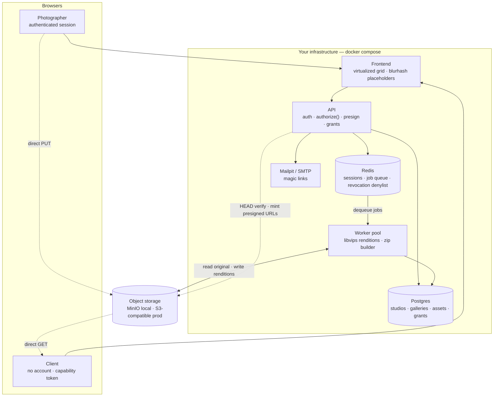
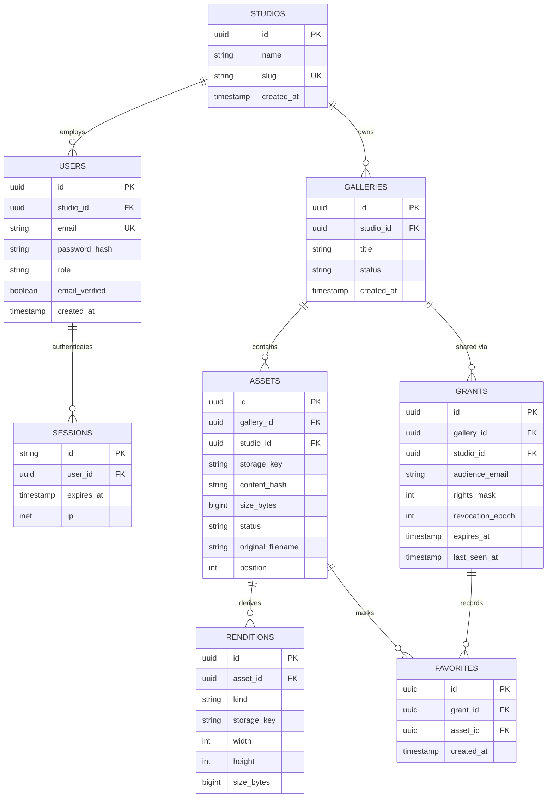
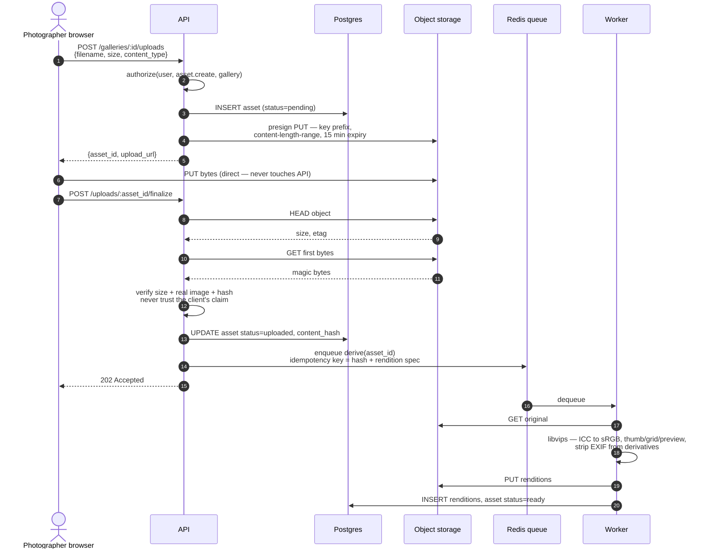
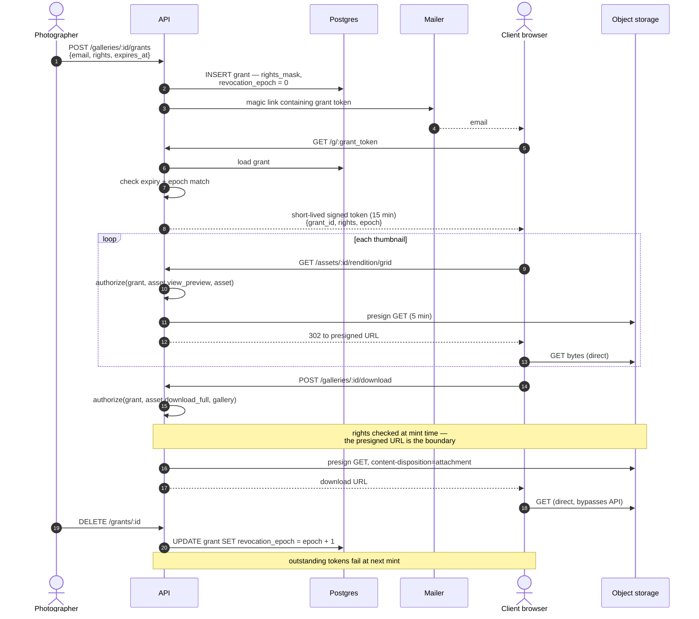
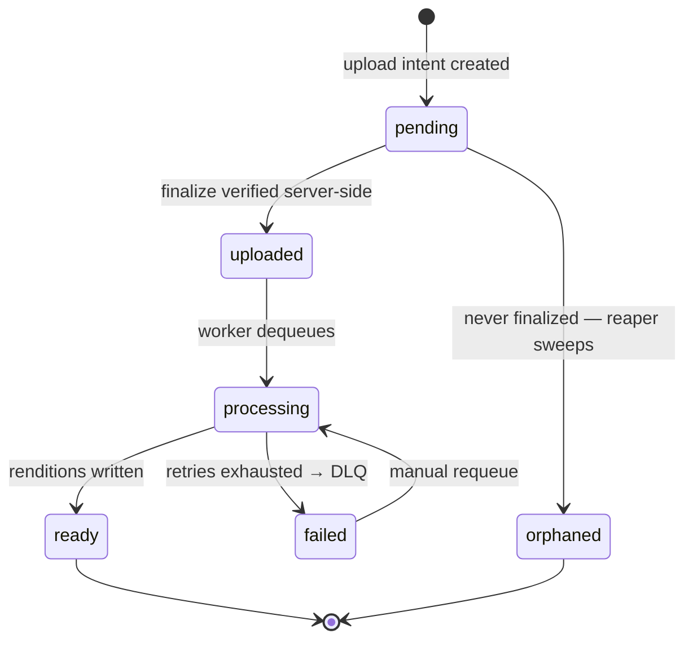

# Architecture

A self-hostable client gallery app for photographers. A photographer uploads photos, sends a client a
link, and the client opens it without an account and either downloads their photos or picks favorites.

## Core design decisions

1. **One gallery model, not two.** A gallery is *a set of assets plus a grant of specific rights to a
   specific audience for a window*. Delivery is `{view, download}`; proofing is `{view, favorite}`.
   Same table, same access path, different rights mask.
2. **Two auth planes.** Photographers have accounts. Clients do not — they hold capability grants.
   These need fundamentally different machinery.
3. **Bytes bypass the API.** Uploads go browser → storage. Downloads go storage → browser. The API
   mints URLs and verifies objects; it never proxies image data.
4. **Rights are enforced at presigned-URL mint time.** The presigned URL is the security boundary.
   Everything else is UI.

---

## 1. Containers



**Dashed edges are image bytes moving without touching the API.** That is the property that makes the
whole thing cheap to run: steady-state serving cost is approximately zero, because every client view and
every download goes storage → browser directly. Your servers see bytes exactly once, during rendition
generation.

The storage node sits outside the compose box on purpose — it's behind a thin interface, so MinIO
locally and any S3-compatible provider in production are configuration, not code.

---

## 2. Data model



Two things worth defending in an interview:

- **`studio_id` is denormalized onto `assets` and `grants`** even though it's reachable via the gallery.
  This lets tenant scoping be a single predicate on every query rather than a join you can forget. Pair it
  with a base repository that *requires* tenant context — make the mistake structurally impossible, not a
  matter of discipline.
- **`favorites` hangs off `grant_id`, not a user.** There is no client user to attach it to. This falls
  directly out of the no-accounts decision, and it's the moment the design stops being a normal CRUD app.

---

## 3. Upload pipeline



The finalize step is the whole trust boundary. Because bytes never pass through the API, the server has
no idea what actually landed in the bucket — so it has to go look. Skip this and you've built an open
file host for anyone who can request an upload URL.

The presigned PUT is scoped three ways: a key prefix (they can't write outside their own path), a
`content-length-range` (they can't upload a 40GB file), and a short expiry.

---

## 4. Client access — capability grants



This is the part of the system worth talking about. The tension: capability tokens want to be
stateless (fast, no DB hit per thumbnail) *and* instantly revocable (the photographer clicks "revoke"
and it means something). Pure JWTs can't be revoked; pure DB lookups cost a query per thumbnail, and a
500-photo gallery is 500 thumbnails.

The resolution is the two-tier structure above: a long-lived DB-backed grant row mints short-lived
signed tokens carrying a `revocation_epoch`. Bump the epoch and every outstanding token dies at its next
mint — bounded by the token TTL, not instant. When instant matters, a Redis denylist covers the gap.

Everything routes through one function:

```
authorize(principal, action, resource, context) -> Decision
```

where `principal` is either a studio user or a grant. Actions: `gallery.view`, `asset.view_preview`,
`asset.download_full`, `selection.favorite`, `selection.submit`, `gallery.manage`. No permission checks
anywhere else in the codebase.

---

## 5. Asset lifecycle



`orphaned` is the state people forget. Every presigned upload URL you hand out is a row that may never
be finalized — the browser closed, the wifi died, someone was probing your API. Without a reaper you
accumulate rows pointing at objects that may or may not exist, and you pay to store them forever.

---

## Threat model

| Threat | Mitigation |
|---|---|
| Upload URL abused as a free file host | Key prefix + `content-length-range` + short expiry; server-side magic-byte and size verification at finalize |
| Client shares gallery link publicly | Grants expire; email-gated magic link; revocation epoch; per-grant rate limits on mint |
| Guessing another gallery's assets | Presigned URLs minted only after `authorize()`; asset IDs are UUIDs; tenant predicate on every query |
| Revoked client keeps their token | Short token TTL bounds the window; Redis denylist for immediate kill |
| Cross-tenant data leak | `studio_id` on every row; base repository requires tenant context |
| Stolen preview reveals location | EXIF stripped from all derivatives; originals retain it |
| Worker retry duplicates work | Idempotency key = content hash + rendition spec |

## Not built (deliberately)

Delegation and sub-grants, bring-your-own-bucket, entitlement ledgers and download quotas, watermarking,
selection versioning, payments, custom domains, face detection. Each is a real feature; none is needed
for the eight things this app does.
